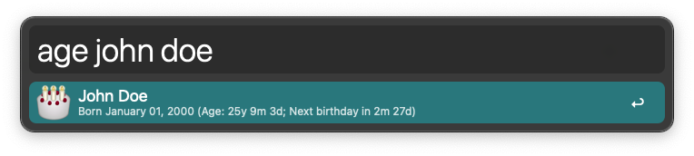
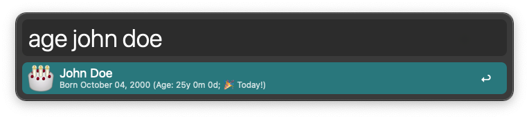

# Contact Ages Alfred Workflow

Search your contacts by name and see their current age and how long until their next birthday.

## Usage

1. Activate Alfred (e.g., Option (⌥) + Space).
2. Type `age <contact name>`.
3. Browse the results:
   - Subtitles shows birthday, current age, and next birthday.
   - Press ENTER to open the contact in Contacts.app.
   - Press CMD+C to copy the contact info to clipboard.
   - Press CMD+L to show the info in Large Type.

## Installation

1. Download the latest version from [the releases page](https://github.com/TravisCarden/alfred-contact-ages/releases)
2. Double-click the downloaded `.alfredworkflow` file to install it in Alfred.

## Requirements

- Alfred 5 with Powerpack
- Python 3 installed (e.g., at `/usr/bin/python3` [via Homebrew](https://docs.brew.sh/Homebrew-and-Python))

## Support

This is a minimally supported personal project. You're welcome to use the issue queue, but I can't promise to respond quickly. I have as little free time as you do. 🙂

## License

MIT License — see [LICENSE](LICENSE) for details.
